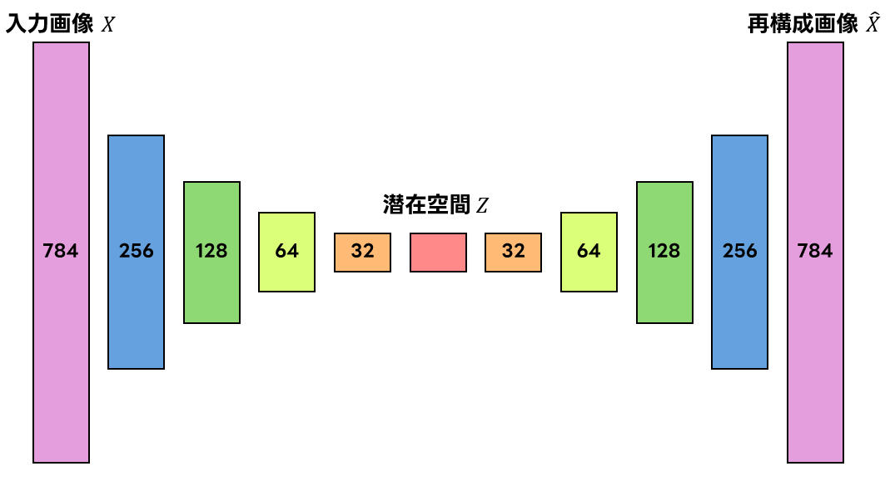
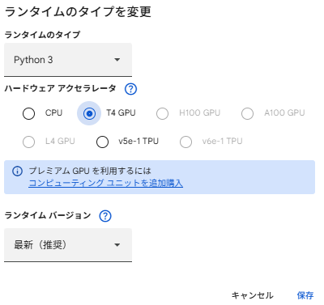

# アドバンスドビジョン-課題

## 概要
本リポジトリは，オートエンコーダを使用してMINIST手書き数字データセットを画像の次元圧縮および再構成をおこなった．
オートエンコーダは以下の2つのネットワークから構成させる人工ニューラルネットワークである.
- エンコーダ：入力データを低次元の潜在表現に写像
- デコーダ：潜在表現を用いて元の入力データを再構成

本実装では，全結合層から成る多層構造を用い，誤差逆伝播法によって入力と出力の再構成誤差が最小となるよう学習をおこなった．

## モデルの構造
本実装は，全結合層を使用した多層構造のオートエンコーダを実装した．入力データにはMNISTの手書き文字画像（28×28ピクセル，784次元）を使用し，エンコーダにより段階的に次元削減をおこない，デコーダによって元の次元へ復元する対照的な構造を採用している．本モデルは，エンコーダとデコーダの二つのネットワークで構成されている．

### ネットワーク構成

### エンコーダ
- **入力層** : 784次元
- **隠れ層1** : 256次元（活性化関数：ReLU）
- **隠れ層2** : 128次元（活性化関数：ReLU）
- **隠れ層3** : 64次元（活性化関数：ReLU）
- **隠れ層4** : 32次元（活性化関数：ReLU）
- **潜在空間** : 32次元（活性化関数：ReLU）

### デコーダ
- **隠れ層1** : 32次元（活性化関数：ReLU）
- **隠れ層2** : 64次元（活性化関数：ReLU）
- **隠れ層3** : 128次元（活性化関数：ReLU）
- **隠れ層4** : 256次元（活性化関数：ReLU）
- **出力層** : 784次元（活性化関数：Sigmoid）

### 学習の設定
- **最適化アルゴリズム** : Adam
- **損失関数** : Binary Cross-Entropy

## 数式
本実装で使用したオートエンコーダは，入力データ $x \in [0,1]^{784} $ を低次元の潜在表現に写像した後，元の入力データを再構成するモデルである．

#### エンコーダ
入力を $x$ ，潜在表現を $z$ ，パラメータを $θ$ とするとエンコーダは次式で表させる．

$$
z = f_θ(x)
$$

本モデルでは，全結合層および活性化関数ReLUを使用して構成する．

#### デコーダ
パラメータを $Φ$ とするとデコーダは次式で表させる．

$$
\hat{x} = g_φ(z)
$$

出力層にはSigmoid関数を使用して，画素値を[0, 1]の範囲に制限している．

#### 活性化関数
- ReLU

$$
ReLU(x) max(0, x)
$$

- Sigmoid

$$
\sigma(x) = \frac{1}{1+e^{-x}}
$$

#### 損失関数
本実装では再構成誤差としてBinary Cross-Entropyを使用した．損失を $L$ とすると $x$ および $\hat{x}$ の誤差は次式で表させる．

$$ 
L(x, \hat{x}) = -\sum_{i=1}^{784}[x_i log\hat{x_i}+(1-x_i)log(1-\hat{x_i})]
$$

## 実行方法（Google Colab）
1. 以下のボタンから，Google Colab上でノートブックを直接開くことができます．

2. ランタイムのタイプを「Python 3」に設定し，ハードウェア　アクセラレータを GPU（T4 推奨）に設定してください．

3. ノートブック上部から順にセルを実行してください．

## 動作環境
- 実行環境：Google Colab
- GPU：NVIDIA Tesla T4
- Python：3.12.12
- Matplotlib：3.10.0

## 参考文献
[Buliding Autoencoders in Keras](https://blog.keras.io/building-autoencoders-in-keras.html) (Apache License, Version 2.0)

## ライセンス
このリポジトリはApache License, Version 2.0に基づいて公開されています．

ライセンスの全文は[LICENSE](https://github.com/showsalmon/AdvancedVision2025/blob/main/LICENSE)またはhttps://www.apache.org/licenses/LICENSE-2.0 から確認できます．

© 2026 Sho Haneishi